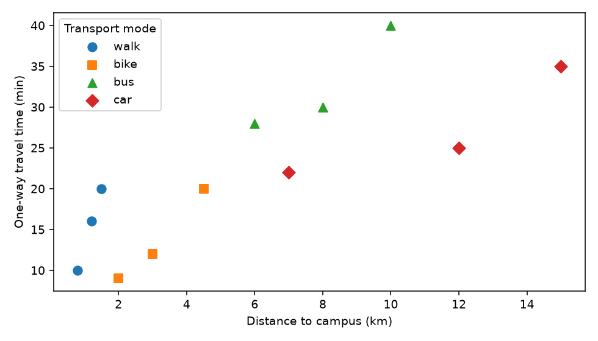

# Language of data

A useful analysis begins with a precise question. Suppose a university wants to describe how students travel to campus. The population is all enrolled students, an observational unit is one student, and the variables include travel time and transport mode. A sample provides information about only some of those students. Before calculating anything, establish who each record represents and how those records were obtained.

## A first data frame in Python

A tidy table has one observation per row and one variable per column. An identifier distinguishes records but does not measure a quantity: averaging student IDs has no statistical meaning.

The following small, fictional survey is a teaching example, not evidence about an actual university. Run the Python blocks in this section in order in a notebook. They use `pandas`, `numpy` and `matplotlib`, and require no external data downloads. If these packages are missing, install them in the Python environment used by your notebook:

```bash
python -m pip install pandas numpy matplotlib
```

```python
from io import StringIO

import numpy as np
import pandas as pd
import matplotlib.pyplot as plt

survey_csv = """student_id,faculty,year,mode,distance_km,time_min,days_on_campus
S01,Engineering,1,bus,8.0,30,4
S02,Engineering,2,bike,3.0,12,5
S03,Engineering,3,walk,1.2,16,3
S04,Engineering,1,car,12.0,25,4
S05,Business,2,bus,6.0,28,3
S06,Business,3,walk,0.8,10,5
S07,Business,1,bike,4.5,20,4
S08,Business,2,car,15.0,35,2
S09,Science,3,bus,10.0,40,5
S10,Science,1,bike,2.0,9,4
S11,Science,2,walk,1.5,20,3
S12,Science,3,car,7.0,22,4
"""
students = pd.read_csv(StringIO(survey_csv), dtype={"student_id": "string"})
print(students.head())
print("Rows and columns:", students.shape)
students.info()
print("Missing values:\n", students.isna().sum())
```

The table contains 12 rows and seven columns. `head()` previews the records; `info()` reports storage types and non-missing counts. For your own CSV file, replace `StringIO(survey_csv)` with its file path. Always inspect imported values before assuming that the import interpreted them correctly.

## Statistical types and storage types

| Variable | Statistical role or type | Interpretation |
| --- | --- | --- |
| `student_id` | Identifier | A label for a student |
| `faculty` and `mode` | Nominal categorical | Categories without a natural ranking |
| `year` | Ordinal categorical | Ordered stages of study |
| `days_on_campus` | Discrete numerical | A count of days in a week |
| `distance_km` and `time_min` | Continuous numerical | Measurements, possibly rounded when recorded |

Python's storage type does not determine a variable's statistical meaning. For example, `year` is initially stored as an integer, but here it represents an ordered stage. Travel time remains a continuous measurement even when respondents report whole minutes.

```python
students["faculty"] = students["faculty"].astype("category")
students["mode"] = pd.Categorical(
    students["mode"], categories=["walk", "bike", "bus", "car"]
)
students["year"] = pd.Categorical(
    students["year"], categories=[1, 2, 3], ordered=True
)
print(students["mode"].value_counts(sort=False))
```

Setting `ordered=True` records the order of the study years. It does not establish that differences between stages measure equal amounts of knowledge. Declaring categories also requires care: values outside the declared set become missing, so check spelling and valid values first.

## Filtering and working with categories

Suppose we want to inspect only students who walk or cycle. A Boolean condition selects the relevant rows; `.copy()` creates a separate table for subsequent changes.

```python
active = students.loc[students["mode"].isin(["walk", "bike"])].copy()
print(active["mode"].cat.categories.tolist())
active["mode"] = active["mode"].cat.remove_unused_categories()
print(active["mode"].cat.categories.tolist())
print("Students travelling actively:", len(active))
```

The result has six students. Filtering removes rows, but initially preserves the four possible transport categories. Removing unused categories changes that metadata to `walk` and `bike`; it does not remove any additional students.

## Creating variables and preserving information

A derived variable should answer a stated question. Here we calculate travel speed, group commute lengths and combine transport modes. Speed is distance divided by time expressed in hours:

$$
\text{speed in km/h}=\frac{\text{distance in km}}{\text{time in minutes}/60}.
$$

```python
valid_time = students["time_min"].where(students["time_min"] > 0)
students["speed_kmh"] = students["distance_km"] / (valid_time / 60)
students["commute_band"] = pd.cut(
    students["time_min"],
    bins=[0, 15, 30, np.inf],
    labels=["up to 15 min", "over 15 to 30 min", "over 30 min"],
    include_lowest=True,
)
students["active_travel"] = students["mode"].astype("string").map(
    {"walk": "yes", "bike": "yes", "bus": "no", "car": "no"}
).astype("category")
print(students[["student_id", "speed_kmh", "commute_band", "active_travel"]])
```

The intervals include their right endpoints: 15 minutes belongs to the first band and 30 to the second. The original time column remains available. Grouping makes a report simpler but hides differences within bands, such as the difference between 16 and 29 minutes. A zero or negative travel time produces a missing speed here and should trigger a data-quality investigation.

## Looking at relationships

```python
fig, ax = plt.subplots(figsize=(7, 4))
markers = {"walk": "o", "bike": "s", "bus": "^", "car": "D"}
for mode, group in students.groupby("mode", observed=True):
    ax.scatter(
        group["distance_km"], group["time_min"],
        label=mode, marker=markers[mode], s=55,
    )
ax.set(xlabel="Distance to campus (km)", ylabel="One-way travel time (min)")
ax.legend(title="Transport mode")
fig.tight_layout()
plt.show()
```



Each point represents one student. Compare students travelling similar distances and notice that mode helps explain why their times differ. A plot of these fictional observations cannot establish how changing transport mode would affect a particular student's journey.

**Practice.** Select students with journeys longer than 30 minutes. Report their IDs, then explain why a table containing only those students cannot describe the full distribution of travel times. Create a new variable for travel time in hours without overwriting `time_min`.

**Check.** The selected students are S08 and S09. Their selection deliberately excludes shorter journeys. Convert minutes to hours by dividing by 60.
