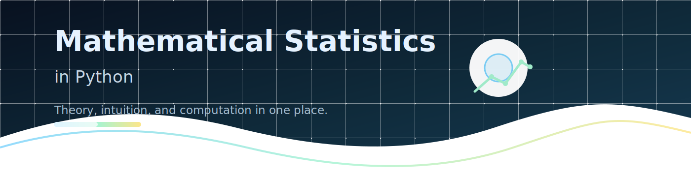

# 

# Mathematical Statistics in Python

Welcome to Mathematical Statistics in Python. This book is a practical, readable introduction to mathematical statistics, with a clear emphasis on intuition, theory, and computation.

<div class="hero-panel">
	<p class="eyebrow">Core idea</p>
	<p>The material focuses on building statistical intuition, then turning that intuition into rigorous methods and clear calculations.</p>
</div>

<p align="center">
	
</p>

## Key Learning Outcomes

These are the key learning outcomes for this material:

1. Understand the language of mathematical statistics and why it matters.
2. Translate probability ideas into Python code and simulations.
3. Work comfortably with random variables, distributions, and summaries.
4. Use estimation and hypothesis testing as practical analytical tools.
5. Write clear, reproducible notebooks and explanations.
6. Connect theory with computation instead of treating them as separate topics.

```{tip}
The title chapter is meant to be copied and adapted for each future chapter in the book.
```

## Chapter Map

1. Foundations and notation.
2. Probability models and distributions.
3. Estimation and uncertainty.
4. Hypothesis tests and interpretation.

## What you will find inside

| Area | Covers |
| --- | --- |
| Foundations | random variables, distributions, expectation, variance |
| Inference | estimation, confidence intervals, hypothesis tests |
| Practice | simulations, visualizations, Python computation |

---

<p align="right"><strong>21 July 2026</strong><br>dr inż. Karol Flisikowski, prof. PG</p>
